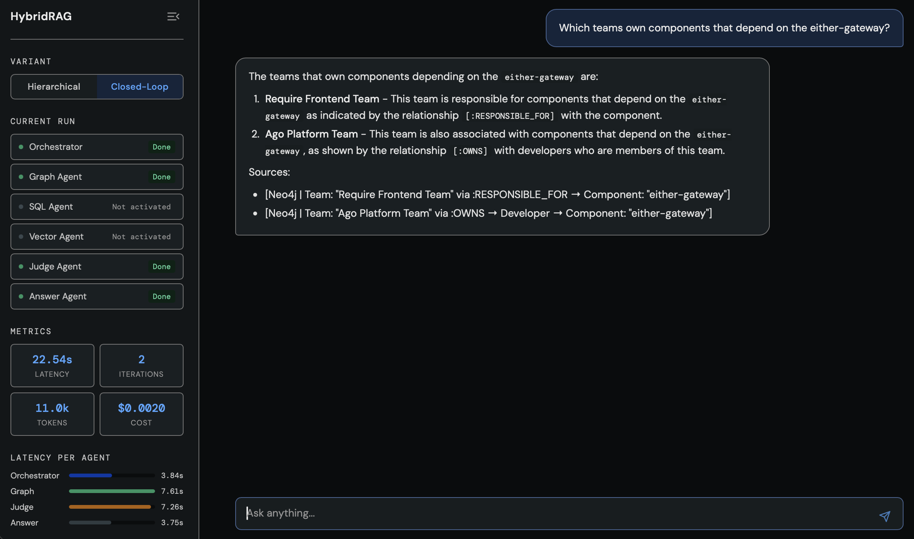

# Hybrid Multi-Agent RAG Architecture


[](https://github.com/ptrick13/HybridRAG/actions/workflows/ci.yml)

A **hybrid multi-agent Retrieval-Augmented Generation (RAG) system** that routes queries across three specialised retrieval agents connected to three heterogeneous data stores — a vector database, a knowledge graph, and a relational database.

---

## Architecture Overview

```
                               User Query
                                   │
                                   ▼
                       ┌───────────────────────┐
                       │      Orchestrator     │◄──────────────────┐
                       └───────────┬───────────┘                   │
                                   │                               │
                   ┌───────────────┼───────────────┐               │
                   ▼               ▼               ▼               │
            ┌────────────┐  ┌────────────┐  ┌────────────┐         │
            │   Vector   │  │   Graph    │  │    SQL     │         │
            │   Agent    │  │   Agent    │  │   Agent    │         │
            │  (Qdrant)  │  │  (Neo4j)   │  │ (Postgres) │         │
            └──────┬─────┘  └──────┬─────┘  └──────┬─────┘         │
                   └───────────────┼───────────────┘               │
                                   │                               │
                                   ▼                               │
                       ┌───────────────────────┐      rejected     │
                       │      Judge Agent      │───────────────────┘
                       └───────────┬───────────┘
                                   │ accepted
                                   ▼
                       ┌───────────────────────┐
                       │     Answer Agent      │
                       └───────────────────────┘

                   Judge Agent + loop: Variant 2 only
```

### Two Workflow Variants

| Feature | V1 (without closed-loop) | V2 (with closed-loop) |
|---|---|---|
| Stages | Orchestrator → Retrieval → Answer | Orchestrator → Retrieval ↔ Judge → Answer |
| Quality control | None | Judge Agent (4 criteria) |
| Max iterations | 1 | 3 |
| Query rewriting | No | Yes (on rejection) |

---

## Tech Stack

| Component | Technology |
|---|---|
| **LLM** | GPT-4o via OpenAI API (Azure OpenAI also supported) |
| **Embeddings** | text-embedding-3-large (3072 dims) |
| **Vector DB** | Qdrant — hybrid dense + BM25 sparse with RRF fusion |
| **Graph DB** | Neo4j — Cypher queries |
| **Relational DB** | PostgreSQL — SQL queries |
| **Workflow** | LangGraph — parallel retrieval via `Send()` fan-out |
| **MCP Server** | FastMCP on port 8001 |
| **A2A Server** | FastAPI on port 8002 (Google Agent2Agent protocol) |
| **Configuration** | pydantic-settings — all parameters from `.env` |

---

## Project Structure

```
hybridrag/
├── agents/
│   ├── client.py          # Shared AsyncOpenAI client
│   ├── orchestrator.py    # Query routing + decomposition
│   ├── vector_agent.py    # Semantic search (Qdrant)
│   ├── graph_agent.py     # Graph queries (Neo4j) with self-correction
│   ├── sql_agent.py       # SQL queries (PostgreSQL) with self-correction
│   ├── judge_agent.py     # Quality evaluation (V2 only)
│   ├── answer_agent.py    # Response synthesis with citations
│   └── usage.py           # Token usage tracking + cost computation
├── config/
│   └── settings.py        # Centralised config via pydantic-settings
├── tools/
│   ├── qdrant_client.py   # Hybrid dense + BM25 retrieval with RRF
│   ├── neo4j_client.py    # Cypher query execution
│   └── postgres_client.py # SQL query execution
├── workflows/
│   ├── models.py          # Shared Pydantic data models
│   ├── state.py           # LangGraph WorkflowState TypedDict + reducers
│   ├── nodes.py           # Shared node functions (orchestrator, retrieval, judge, answer)
│   ├── registry.py        # Agent name → callable mapping
│   ├── v1_workflow.py     # V1: START → orchestrator → Send() × N → answer → END
│   └── v2_workflow.py     # V2: closed-loop — judge routes back to orchestrator on REJECT
├── integrations/
│   ├── mcp_server.py      # FastMCP endpoint (port 8001)
│   └── a2a_server.py      # FastAPI A2A endpoint (port 8002)
├── evaluation/
│   ├── runner.py          # Evaluation runner + CLI
│   ├── metrics.py         # LLM-as-Judge scoring
│   └── test_queries.json  # 17 test queries across 6 categories
├── data/
│   ├── generate_sample.py # Generates synthetic sample data
│   ├── load_data.py       # Data loading orchestrator (CLI)
│   ├── ingest_postgres.py # PostgreSQL ingestion
│   ├── ingest_neo4j.py    # Neo4j graph ingestion
│   ├── ingest_qdrant.py   # Qdrant embedding + indexing
│   └── sample/            # Generated sample dataset (JSON)
├── scripts/
│   ├── web_ui.py          # FastAPI web UI (port 8000)
│   └── static/
│       └── index.html     # Single-page frontend
├── docker-compose.yml     # PostgreSQL + Neo4j + Qdrant
├── requirements.txt
└── .env.example
```

---

## Demo

Interface showing the Closed-Loop variant answering a graph query, with per-agent status, latency breakdown, token count, and cost:



---

## Quick Start

### Prerequisites

- Python 3.11+
- Docker and Docker Compose
- OpenAI API key (or Azure OpenAI credentials)

### 1. Clone and install

```bash
git clone https://github.com/ptrick13/HybridRAG.git
cd HybridRAG
pip install -r requirements.txt
```

### 2. Configure environment

```bash
cp .env.example .env
# Edit .env and set your OPENAI_API_KEY
```

### 3. Start the databases

```bash
docker-compose up -d
# Wait until all services are healthy — Neo4j may take ~60s on first start
docker-compose ps
```

### 4. Generate and load sample data

```bash
python -m data.generate_sample
python -m data.load_data
```

### 5. Start the web UI

```bash
uvicorn scripts.web_ui:app --host 0.0.0.0 --port 8000
# Open http://localhost:8000
```

---

## Usage

### MCP Server

```bash
python -m integrations.mcp_server
# Starts at http://localhost:8001
```

Tool: `query_hybrid_rag(query: str, variant: str = "v1") -> str`

### A2A Server

```bash
uvicorn integrations.a2a_server:app --port 8002
```

- `GET /.well-known/agent.json` — Agent Card
- `POST /tasks/send` — Execute a query

### Evaluation

```bash
# All 17 queries against both variants
python -m evaluation.runner

# Filter by category or variant
python -m evaluation.runner --category SEM --variant v1
```

Results are saved to `evaluation/results/` and include faithfulness, relevancy, completeness, citation accuracy, latency, and cost per query.

Sample run: [evaluation/results/RESULTS.md](evaluation/results/RESULTS.md)

---

## Testing

No running databases, no API keys required — all LLM and database calls are replaced with mocks so the suite runs in seconds.

```bash
# Lint
ruff check .

# Tests
pytest -v
```

| Test file | What is tested |
|---|---|
| `tests/test_orchestrator.py` | `route_query()` — JSON parsing, multi-agent routing, error handling, token tracking |
| `tests/test_judge.py` | `evaluate()` — ACCEPT / REJECT / MAX_ITERATIONS decisions, prompt construction, history serialization |
| `tests/test_nodes.py` | `orchestrator_node`, `single_retrieval_node`, `judge_node` — latency recording, state mutations |
| `tests/test_routing.py` | V1 `_dispatch()` fan-out via `Send()` and V2 `_judge_routing()` edge conditions |
| `tests/test_answer_format.py` | `_format_results_for_prompt()` — per-source headers, conflict and gap sections |
| `tests/test_state.py` | `_merge_latencies()` reducer — accumulation, immutability, disjoint merge |
| `tests/test_usage.py` | Token accumulation, per-model cost computation, `asyncio` context-var isolation |

---

## Example Queries

### SEM — Semantic (Vector Agent)
```
Which postmortems had an external dependency failure as root cause?
What architectural decisions mention circuit breaker patterns?
Find tickets related to database connection timeout issues
```

### REL — Relational (Graph Agent)
```
Which teams own components that depend on the either-gateway?
Who are the top contributors to database-type components by commit count?
Which components have the deepest transitive dependency chains?
```

### STR — Structured (SQL Agent)
```
Which components have a deployment rollback rate above 20% in 2024?
Show sprint velocity trends for the backend department over the last 10 sprints.
Which components show 4 or more consecutive months of declining test coverage?
```

### MIX — Multi-source
```
What teams own components with the highest bug reopen rates, and what do their ADRs say about quality?
Which components have the most P1 incidents, and who owns them in the knowledge graph?
Find postmortems mentioning cascading failures and show the rollback rate for the involved components.
```

### CON — Conflict detection
```
Show components flagged in postmortems and with a high rollback rate — do the two lists agree?
```

### EDGE — Edge cases
```
What is today's weather in Berlin?              # out of scope
Find postmortems for service XYZ123Foobar.      # empty result
```

---

## Data Sources

Synthetic dataset representing a fictional software organisation: 80 developers, 12 teams, 70 components. Generated by `data/generate_sample.py` — no external downloads required.

### Neo4j — Knowledge Graph

Nodes: `Team`, `Developer`, `Component`, `Repository`, `Epic`

| Relationship | Direction | Properties |
|---|---|---|
| `MEMBER_OF` | Developer → Team | `since` |
| `OWNS` | Developer → Component | — |
| `RESPONSIBLE_FOR` | Team → Component | — |
| `DEPENDS_ON` | Component → Component | `type` |
| `HOSTED_IN` | Component → Repository | — |
| `AFFECTS` | Epic → Component | — |
| `CONTRIBUTED_TO` | Developer → Component | `commits` |

### PostgreSQL — Structured Metrics

| Table | Description |
|---|---|
| `tickets` | Bug, feature, and incident tickets with priority and status |
| `sprint_metrics` | Per-sprint velocity, planned/completed points, bug counts |
| `deployments` | Deployment history with status (success/failed/rollback) |
| `test_coverage` | Monthly line and branch coverage per component |
| `incidents` | P1–P3 incidents with root cause component and MTTR |

### Qdrant — Semantic Search

Three collections using hybrid retrieval (dense + BM25 sparse, RRF fusion):

| Collection | Content |
|---|---|
| `dev_tickets` | Ticket descriptions |
| `dev_arch_docs` | ADRs, design docs, RFCs |
| `dev_postmortems` | Postmortem narratives |

Embeddings: `text-embedding-3-large` (3072 dims), chunked at 512 tokens with 64-token overlap.

---

## Context

This project was developed as an independent implementation inspired by my Master's thesis on hybrid multi-agent RAG architectures for enterprise AI applications.

---

## License

MIT © Patrick Vorreiter